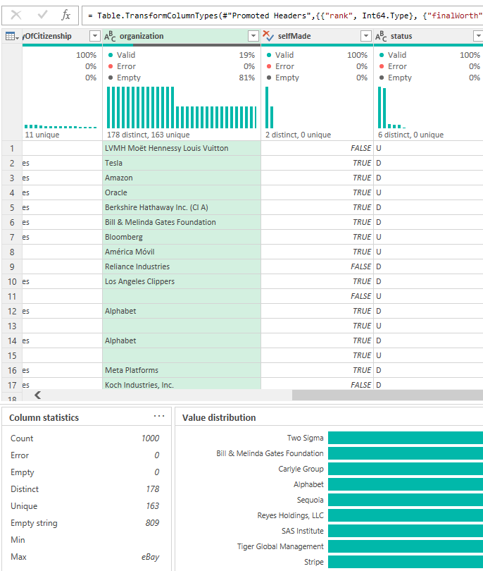

# Project Overview

 

This is a project demonstrating the process of conducting exploratory data analysis on a given dataset. It is set within a fictional scenario, representing a request from a Business Analysis Manager. 

### Data Source

- **Dataset**: "Billionaires Statistics Dataset" (2023)
- **Provided by**: NIDULA ELGIRIYEWITHANA 
- [Dataset Link](https://www.kaggle.com/datasets/nelgiriyewithana/billionaires-statistics-dataset/data)

### Used Software and Technologies

- Excel (Power Query, Power Pivot)
- SQL Server Management Studio (SSMS)

### Approach

- Analysis was made parallelly using Excel and SQL to provide additional validation to the results and enrich them with visuals.

 

## Business Problem

Our Business Analysis Manager has requested assistance with a research project, part of which involves a demographic analysis of billionaires on a global scale. The objective is to gain a better understanding of the demographics of billionaires and the various factors influencing their financial success.

The primary analysis objectives are as follows:

Basic Statistics Analysis: We aim to derive basic statistics, such as the mean net worth, average age of billionaires, and a distribution of billionaires in various industries and countries.

Identifying Demographic Trends: We intend to explore the impact of age, gender, source of wealth, taxes, and countries of residence on the financial success of billionaires.

Self-Made Wealth Analysis: We are keen on determining the percentage of billionaires who have generated their wealth independently, without inheritance.

 

### User Stories

| No | As a              | I want                                                         | So that                                       | Acceptance Criteria |
|----|-------------------|----------------------------------------------------------------|-----------------------------------------------|--------------------|
| 1  | Marketing Analyst | To have a better understanding of the billionaires' landscape. | I can profile them as potential clients.      | The analysis should include statistics about billionaires, allowing the identification of their demographic characteristics, such as age ranges, gender distribution, and regions of residence. Additionally, it should provide insights into their primary industries of interest. |
| 2  | Business Analyst   | To know what are the sources of income of the wealthiest people. | I can make informed decisions about their businesses. | The analysis should provide data on the primary sources of wealth for billionaires, including the top industries and sectors contributing to their wealth. |
| 3  | Business Analysis Manager | To analyze billionaires' demographics and understand their financial situation. | I manage a research project about our potential clients. | The analysis should include information on the number of billionaires considering their age groups, gender distribution, and geographic regions. Additionally, it should provide an overview of the most prevalent industries among billionaires. |

 

# Steps Applied

 
 

1. **Data Import (CSV File) to Microsoft Excel**

 

   

 
 

2. **Data Cleansing & Transformation**

 

- Cleaned data
  - promoted headers
  - checked quality of data
  - removed unnecessary / unusable columns
  - renamed column
  - transformed data using "replace values", "split column"
  - changed data types

 

 
 

 
    
- Transformed data
	- created new table 'Countries' 
	- created index column 'country_id' to act as a primary key
	- added 'country_id' to 'Billionaires' table as a foreign key using 'merge queries' option
	- added index column 'id' identifying each row to 'Billionaires' table

 

 

- Created data model
	- added two tables to the data model
	- established relationship between tables in datamodel
	- created pivot table

 

   
 
 

3. **Import of the .xlsx file into SSMS**

 

 
 

4. **Conducting the analysis**

 

- Potential duplicates:

 
 

- Missing data percentage:

 
 

- Basic statistics:

 
 

- Count of unique industries:

 
 

- Count of unique countries:

 
 

- Billionaires by country:

 
 

- Billionaires per 1 000 000 residents by country:

 
 

- Billionaires by industry:

 
 

- Top 15 sources of wealth:

 
 

- Billionaires and net worth by gender:

 
 

- Countries' tax rates vs. number of billionaires (excluding tax havens):

 
 

- Billionaires and net worth by age groups:

 
 

- Percentage of self-made billionaires:

 
 

5. **Other activities**

- Created additional DAX measures using:
  - IF()
  - ISBLANK()
  - COUNT()
  - SUM()
  - DIVIDE()

 
 

# Conclusions and Key Insights

- The dataset comprises information on 2,637 billionaires.

- The average net worth of a billionaire stands at $4.626 billion.

- The age range of billionaires is extensive, with the oldest being 101 years old and the youngest just 18. The average age among them is 65.

- There are 18 industries associated with billionaire business interests, with dominant sectors including Finance & Investments, Manufacturing, Technology, Fashion & Retail, Food & Beverage, Healthcare, and Real Estate.

- The dataset includes billionaires from 78 countries. The countries with the highest number of billionaires are the USA (753), China (521), and India (157), with only four countries having more than 100 billionaires.

- The primary source of wealth for billionaires is the Real Estate industry.

- Of the total billionaires, 2,301 are male, while 336 are female. Although the average net worth is similar for both genders ($4.633 billion for males and $4.580 billion for females), there is significant gender disparity.

- The analysis of provided data shows no evident correlation between the number of billionaires in a country and its tax rate.

- The majority of billionaires fall within the age range of 50-70 years old, accounting for 74% of all billionaires.

- Out of the total number of billionaires, 68.64% have self-made wealth.

 
 

